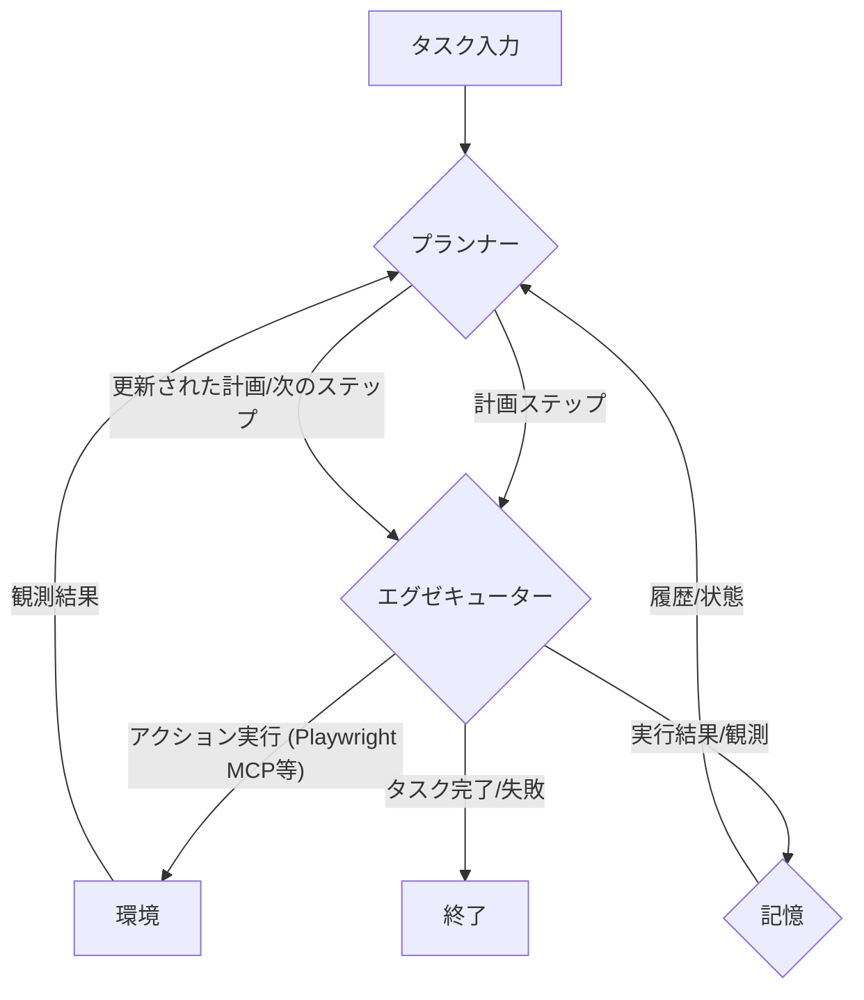

# 03 エージェントアーキテクチャ

このドキュメントは、「Plan-and-Act: Improving Planning of Agents for Long-Horizon Tasks」論文に基づいた、本プロジェクトで実装するエージェントのアーキテクチャについて詳細に説明します。このアーキテクチャは、推論部分に特化しており、LangGraph と Playwright MCP を主要な技術スタックとして利用します。

## 3.1. 基本アーキテクチャ

エージェントは、主に以下の2つのコンポーネントで構成されます。

1.  **プランナー (Planner)**: 高レベルの戦略的な計画を担当します。
2.  **エグゼキューター (Executor)**: プランナーによって生成された計画のステップを実行します。

これらのコンポーネントは、**推論ループ (Inference Loop)** の中で協調して動作し、長期的なタスクを遂行します。



### 3.1.1. プランナー (Planner)

*   **役割**:
    *   ユーザーから与えられた長期的なタスク指示を理解し、初期計画を生成します。
    *   エグゼキューターからのフィードバック（観測結果、アクションの成否）に基づいて、計画の妥当性を評価します。
    *   必要に応じて、**動的な再計画 (Dynamic Replanning)** を行い、計画を修正または詳細化します。これには、予期せぬエラーへの対応、新しい情報の取り込み、目標達成に向けた戦略の調整などが含まれます。
    *   タスクが完了したか、または継続不可能かを判断します。
*   **内部処理フロー (LangGraph ノードとして想定)**:
    1.  **計画生成ノード**: 初期タスクと現在の記憶（履歴、観測）を入力とし、複数の実行可能なステップからなる計画を出力します。
    2.  **計画評価/再計画ノード**: エグゼキューターからの最新の観測結果と現在の計画を入力とし、計画の継続、修正、またはタスク完了/失敗の判断を行います。
        *   成功/期待通り: 次のステップへ。
        *   失敗/予期せぬ結果: 再計画ロジックを発動し、新しい計画または修正された計画を生成します。
        *   完了: 終了シグナルを生成します。
*   **LangGraph における表現**:
    *   プランナーの各思考ステップ（計画生成、評価、再計画など）は、個別の LangGraph ノードとして実装されます。
    *   LLM (Large Language Model) を活用して、推論と計画策定を行います。

### 3.1.2. エグゼキューター (Executor)

*   **役割**:
    *   プランナーから指示された単一または複数の計画ステップを実行します。
    *   主に Playwright MCP (Multi-Agent Control Plane) を介して外部環境（例: ウェブブラウザ）とインタラクションし、アクションを実行します（例: ページのナビゲート、要素のクリック、情報の入力・抽出）。
    *   アクションの実行結果（成功、失敗、取得したデータなど）と、環境から観測された新しい情報をプランナーにフィードバックします。
*   **内部処理フロー (LangGraph ノードとして想定)**:
    1.  **アクション選択/ディスパッチノード**: プランナーからの指示（例: 「特定の情報を検索するためにウェブサイト X にアクセスし、キーワード Y で検索する」）を解釈し、適切な MCP ツール (Playwright MCP) とそのパラメータを選択します。
    2.  **MCP ツール実行ノード**: 選択された MCP ツールを呼び出し、アクションを実行します。Playwright MCP の場合、ブラウザ操作コマンド（`navigate`, `click`, `type`, `snapshot` など）が実行されます。
    3.  **結果処理ノード**: MCP ツールからの実行結果（例: 成功/失敗ステータス、スナップショット、抽出されたテキスト）を整形し、プランナーへのフィードバックとして準備します。
*   **LangGraph における表現**:
    *   エグゼキューターの処理は、一つまたは複数の LangGraph ノードとして実装されます。
    *   `langchain-mcp-adapters` ライブラリを利用して、LangGraph から Playwright MCP サーバーと通信します。

### 3.1.3. 記憶 (Memory)

*   **役割**:
    *   タスクの進行状況、過去の計画、実行されたアクション、得られた観測結果、プランナーの思考プロセスなどを時系列で記録します。
    *   プランナーがより文脈に沿った意思決定（特に再計画時）を行えるように、関連情報を提供します。
    *   長期的なタスクにおいて、過去の失敗から学習したり、堂々巡りを避けたりするのに役立ちます。
*   **LangGraph における表現**:
    *   LangGraph の State オブジェクトの一部として管理されます。
    *   各ノードの実行後、関連情報が記憶に追加・更新されます。

## 3.2. 推論ループ (Inference Loop)

推論ループは、プランナーとエグゼキューターが協調してタスクを遂行するプロセスです。

1.  **初期化**: ユーザーがタスク目標を入力します。記憶は空または初期状態です。
2.  **計画フェーズ (Planner)**:
    *   プランナーはタスク目標と現在の記憶（もしあれば）に基づいて初期計画を生成します。計画は一連の実行可能なステップで構成されます。
3.  **実行フェーズ (Executor)**:
    *   プランナーは計画の次のステップ（またはステップ群）をエグゼキューターに指示します。
    *   エグゼキューターは指示されたステップを実行します。これには Playwright MCP を用いたウェブ操作などが含まれます。
    *   実行後、エグゼキューターは実行結果（成功/失敗）と観測された情報（例: 新しいウェブページの内容、エラーメッセージ）を収集します。
4.  **フィードバックと記憶更新**:
    *   エグゼキューターからの実行結果と観測情報は記憶コンポーネントに記録されます。
    *   これらの情報はプランナーにもフィードバックされます。
5.  **評価と再計画フェーズ (Planner)**:
    *   プランナーはフィードバックされた情報と現在の計画、記憶を照らし合わせて状況を評価します。
    *   **動的な再計画**:
        *   計画が順調に進んでいる場合: 次のステップへ進みます。
        *   予期せぬ結果やエラーが発生した場合: プランナーは計画を修正、破棄、または新しい計画を生成します。例えば、ウェブサイトの構造変更により要素が見つからない場合、代替手段を探す、情報を別のソースから取得する、といった再計画が行われます。
        *   タスク目標が達成された場合: ループを終了します。
        *   タスク目標の達成が不可能と判断された場合: ループを終了し、失敗を報告します。
6.  ステップ 3 に戻り、タスクが完了するか、継続不可能と判断されるまでループします。

## 3.3. LangGraph による実装の構想

この Plan-and-Act アーキテクチャは、LangGraph を用いて以下のように実装できます。

*   **グラフの定義**:
    *   **ノード (Nodes)**: プランナーの主要機能（初期計画生成、計画評価、再計画）、エグゼキューターの主要機能（アクションディスパッチ、MCPツール実行、結果処理）、記憶の更新処理などがそれぞれノードに対応します。
    *   **エッジ (Edges)**: ノード間の制御フローを定義します。例えば、プランナーノードからエグゼキューターノードへ、エグゼキューターノードからプランナーノード（フィードバック経由）へといった流れです。
    *   **条件付きエッジ (Conditional Edges)**: プランナーの評価結果に基づいて、次にどのノードを実行するか（例: 次のステップに進むか、再計画ノードを実行するか、終了ノードに進むか）を動的に決定するために使用します。
*   **状態 (State)**: LangGraph のグラフ全体で共有される状態オブジェクトには、現在のタスク、生成された計画、実行履歴、観測結果、記憶などが含まれます。各ノードはこの状態を読み書きできます。

```mermaid
graph TD
    Start((開始)) --> Planner_Init[プランナー: 初期計画生成];
    Planner_Init -- 計画 --> Executor_Dispatch[エグゼキューター: アクションディスパッチ];
    Executor_Dispatch -- ツール指示 --> Executor_RunMCP[エグゼキューター: MCPツール実行 (Playwright)];
    Executor_RunMCP -- 実行結果/観測 --> Executor_ProcessResult[エグゼキューター: 結果処理];
    Executor_ProcessResult -- 整形済みフィードバック --> Memory_Update[記憶更新];
    Memory_Update -- 更新済み記憶 --> Planner_Evaluate[プランナー: 評価/再計画];
    Planner_Evaluate -- 次のステップ/更新計画 --> Executor_Dispatch;
    Planner_Evaluate -- 要再計画 --> Planner_Replanning[プランナー: 動的再計画];
    Planner_Replanning -- 新計画 --> Executor_Dispatch;
    Planner_Evaluate -- タスク完了/失敗 --> End((終了));
```

## 3.4. Executor と Playwright MCP の連携詳細

エグゼキューターが Playwright MCP を利用する際の具体的な流れは以下のようになります。

1.  **プランナーからの指示**: プランナーは、「arXiv で "Plan-and-Act" に関する最新の論文を探し、その概要を取得せよ」といった抽象的な指示をエグゼキューターに渡します。
2.  **アクションディスパッチ (Executor)**:
    *   エグゼキューターは、この指示を解釈し、具体的な Playwright MCP の操作シーケンスに変換します。
    *   例:
        1.  `mcp_playwright_browser_navigate(url="https://arxiv.org/")`
        2.  `mcp_playwright_browser_type(element="検索ボックス", ref="...", text="Plan-and-Act")`
        3.  `mcp_playwright_browser_click(element="検索ボタン", ref="...")`
        4.  `mcp_playwright_browser_snapshot(random_string="search_results")` (検索結果ページの構造を把握するため)
        5.  (スナップショットを解析し、関連性の高い論文リンクを特定)
        6.  `mcp_playwright_browser_click(element="該当論文リンク", ref="...")`
        7.  `mcp_playwright_browser_snapshot(random_string="paper_details")` (論文詳細ページから概要を抽出するため)
3.  **MCP ツール実行 (Executor)**:
    *   エグゼキューターは、`langchain-mcp-adapters` を介して、上記の各 Playwright MCP コマンドを Playwright MCP サーバーに送信し、実行させます。
    *   Playwright MCP サーバーは、実際にヘッドレスブラウザを操作し、結果（成功/失敗、スナップショット、エラー情報など）を返します。
4.  **結果処理 (Executor)**:
    *   エグゼキューターは、Playwright MCP からの応答（特にスナップショット）を解析し、プランナーが必要とする情報（この例では論文の概要）を抽出します。
    *   抽出した情報と実行ステータスをプランナーにフィードバックします。

この連携により、エージェントはウェブブラウザを介した複雑な情報収集やタスク実行が可能になります。動的なウェブコンテンツやインタラクティブな要素にも対応できる柔軟性が期待されます。

```python
State = TypedDict(
    "State",
    {
        "goal": str,            # ユーザ要求 (immutable)
        "plan": list[str],      # Planner が生成するステップ列
        "step_idx": int,        # 現在実行中のインデックス
        "observation": str,     # Executor の返り値 (最新)
        "history": list[str],   # 過去の (step, observation) ログ
        "needs_replan": bool,   # True なら Planner に戻る
        "finished": bool,       # すべてのステップが完了
    },
    total=False,
)
```

```
| ノード               | 入力                 | 出力                                                                  | キー処理                                                                                        |
| ----------------- | ------------------ | ------------------------------------------------------------------- | ------------------------------------------------------------------------------------------- |
| **Planner**       | `goal`, `history`  | `plan`                                                              | 1. Plan 用プロンプトを整形<br>2. LLM 呼び出し (`temperature` は config)<br>3. 生成を `plan` (list\[str]) へ変換 |
| **Executor**      | `plan`, `step_idx` | `observation`, `needs_replan`, 更新済み `history`, インクリメント済み `step_idx` | 1. 現在ステップ取り出し<br>2. MCP へツール名と引数を投げる<br>3. 観測を `observation` に格納<br>4. 観測をルールで評価し再計画要否を判定   |
| **LangGraph DAG** | –                  | –                                                                   | Planner → Executor → (条件) Planner → … → End                                                 |
```

## 再計画判定例

```python
def should_replan(obs: str) -> bool:
    # 単純例：ツールが "ERROR:" を含めて返したら
    return "ERROR:" in obs
```

> 拡張可能ポイント
> - memory.py に VectorStore 検索を追加
> - LangGraph の分岐条件を外部 JSON で差し替え